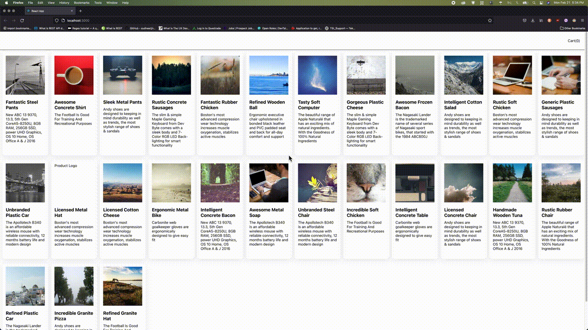
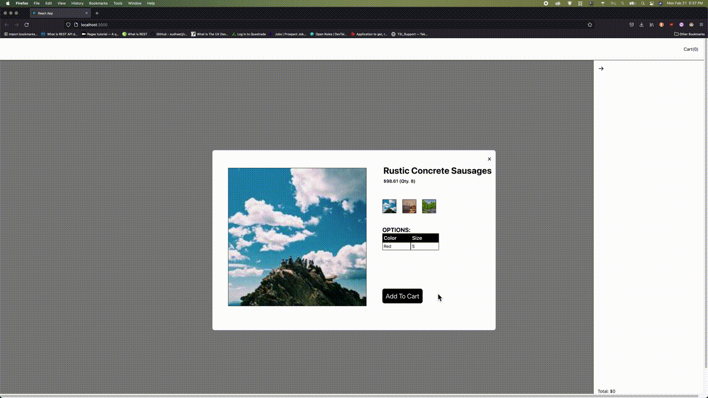
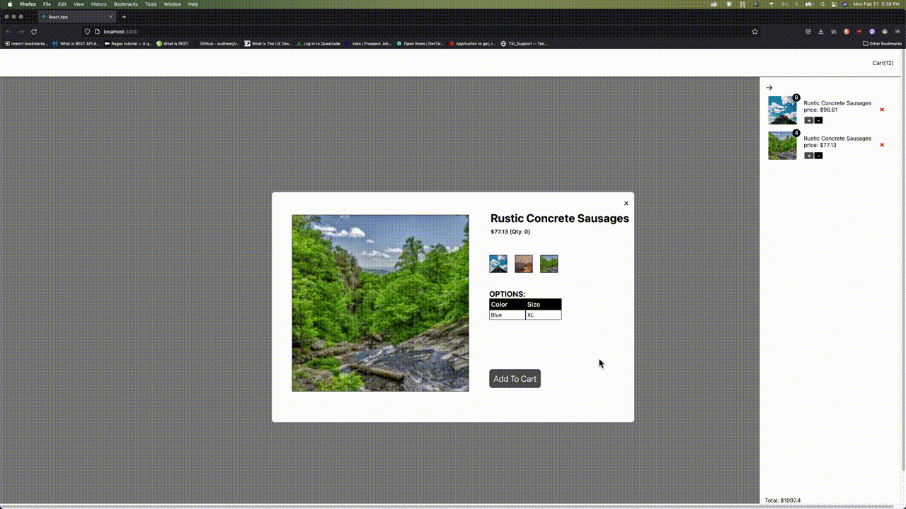

# Bonsai Frontend Interview Assignment

Install [yarn](https://yarnpkg.com/) to get start.

```javascript
yarn
```

### Server

Start backend server with:

```javascript
cd ./server
yarn start
```

Server should be running at `http://localhost:8000` and product endpoint (GET) is located at `http://localhost:8000/products`

### Frontend

Start frontend server with:

```javascript
cd ./frontend
yarn start
```

This app uses `.env`:

```javascript
REACT_APP_PRODUCTS_API=
```

## Features

1. #### Click on the `<ProductCard />` to show the `<ProductVariant />` modal.


2. #### Next, click on the `Add to Cart` button to add the variant to the cart.
   (*Notice how the Cart on the upper right corner also updates*.)


3. #### Finally, click on the `+` or `-` button to add or remove an item to/from the cart.


#### *P.S. Not designed to be mobile friendly.*
